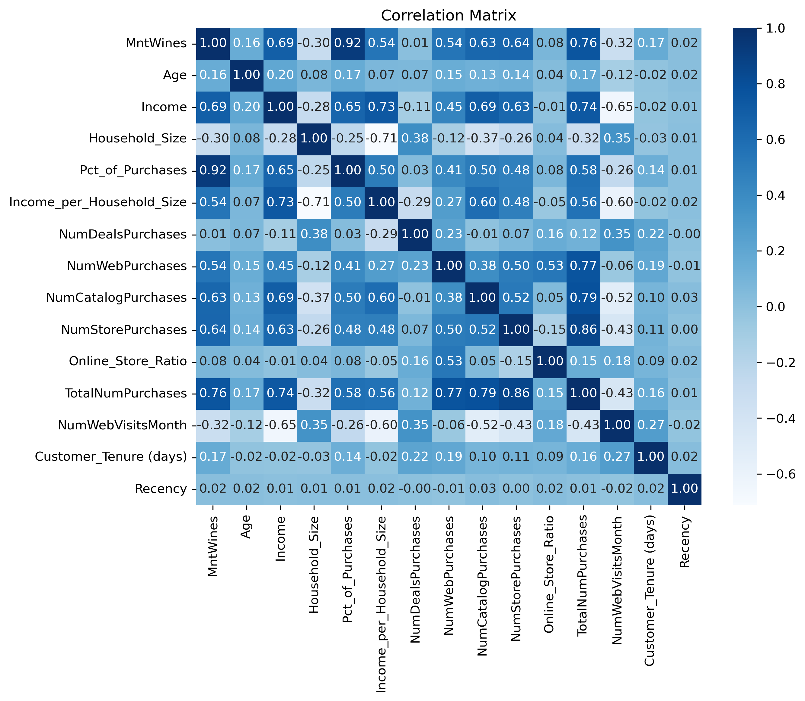
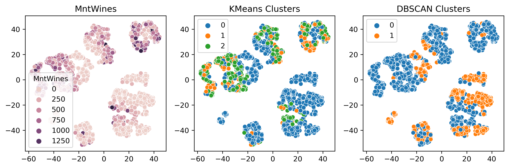
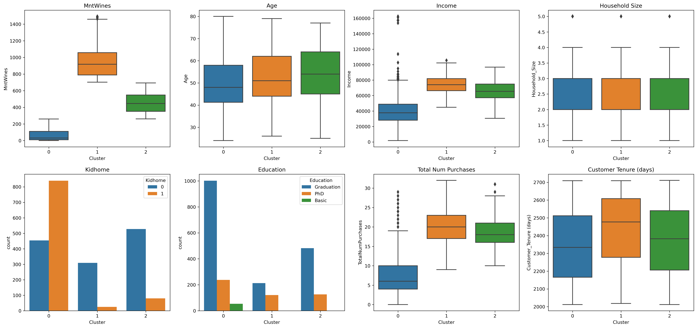
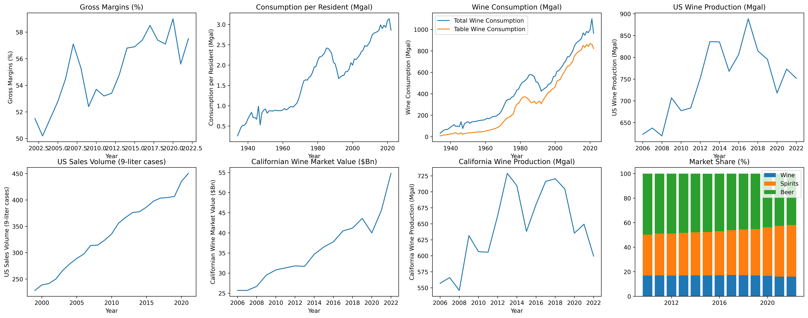
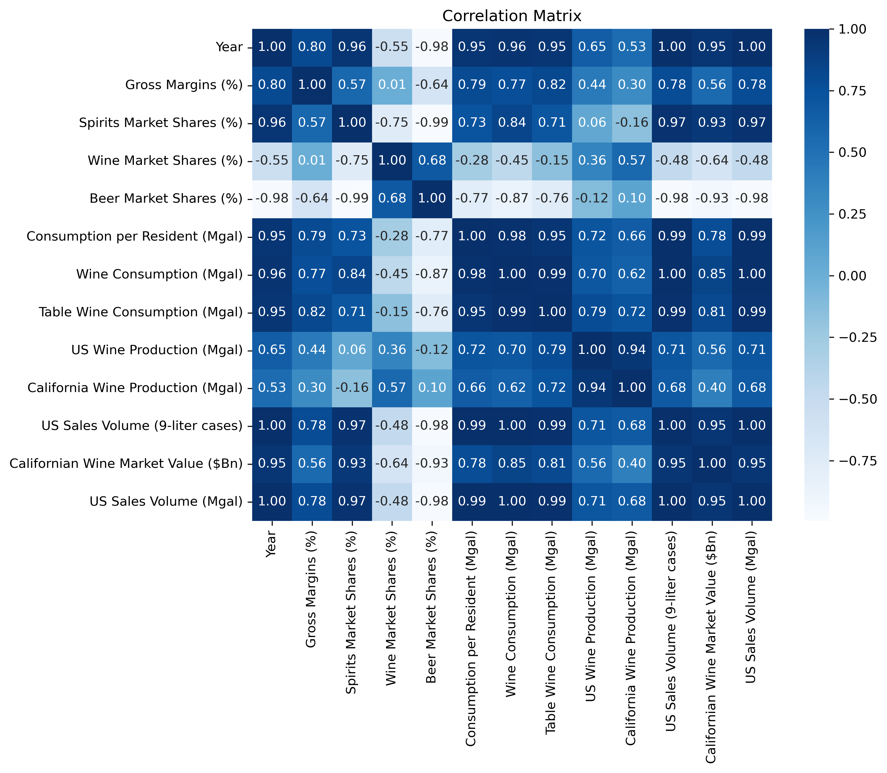

# Wine Company Market Analysis and Forecasting
## 1. Project Overview
This project is divided into two main parts:
1. Customer Segmentation: Analyzing customer data to identify distinct segments within the US market.
2. Forecasting Models: Developing predictive models to forecast key metrics such as wine consumption, sales, and gross margins.
The goal is to provide actionable insights to help the wine company effectively enter and compete in the US market.

## 2. Customer Segmentation
The first part of the project focuses on customer segmentation to understand the different types of customers in the US market. This helps tailor marketing strategies and product offerings to different segments.

### 2.1. Data Description
The dataset "marketing_campaign" from [Kaggle](https://www.kaggle.com/datasets/rodsaldanha/arketing-campaign), published in 2020, was used for this analysis. It contains data about a marketing campaign, including demographic and purchasing information for customers. The following columns were preselected for relevance to our study:
* `Year_Birth`, `Education`, `Marital_Status`, `Income`: Demographic information of the customers
* `Kidhome`, `Teenhome`: Household information
* `Dt_Customer`: The date when the customer was enrolled, which can be used to calculate customer tenure
* `Recency`: The number of days since the last purchase, indicating customer engagement and loyalty.
* `MntWines`: Amount spent on wine
* `NumDealsPurchases`: Number of purchases made with a discount
* `NumCatalogPurchases`: Number of purchases using a catalog
* `NumStorePurchases`: Number of purchases made in-store
* `NumWebVisitsMonth`: Number of visits to the company's website

#### Data Preprocessing
* **Handling Missing Values:** Missing values in the Income column were addressed by imputation.
* **Data Cleaning:** Irrelevant columns were dropped, and the data types were converted as necessary.
* **Feature Engineering:** New features were created, including `Age`, `Household_Size`, `Pct_of_Purchases`, `Income_per_Household_Size`, `Online_Store_Ratio`, `TotalNumPurchases`, and `Customer_Tenure`.
* **Correlation Analysis:** The relationship between each variable and `MntWines` was analyzed using the correlation coefficient.

### 2.2. Exploratory Data Analysis
#### Correlation Analysis:
Numerical variables were analyzed for their correlation with MntWines, with key findings including high correlations for `Income` (0.686), `Pct_of_Purchases` (0.925), and `TotalNumPurchases` (0.756).
The full correlation table is detailed in the figure below.

  

#### ANOVA Tests:
* `Marital_Status` and `MntWines`: Not significant (p-value = 0.278)
* `Education` and `MntWines`: Significant (p-value = 1.21e-20)
* `Income_Level` and `MntWines`: Highly significant (p-value = 1.76e-201). However, we could use `Income` as it is more granular.

#### T-test:
* `Kidhome` and `MntWines`: Significant (p-value = 4.39e-149)
* `Teenhome` and `MntWines`: Not significant (p-value = 0.906)

### 2.3. Clustering
Based on the analysis, the following variables were selected for clustering: `Age`, `Income`, `Household_Size`, `TotalNumPurchases`, `Customer_Tenure`, `Education`, and `Kidhome`. We tested two clustering algorithms: DBSCAN and KMeans. We used the elbow method in order to find the optimal number of cluster for KMeans and obtained the following results:
* DBSCAN (Silhouette Score = 0.335)
* KMeans (Silhouette Score = 0.669)

  

The clusters obtained with KMeans have a significantly higher silhouette score than the ones with DBSCAN. The characteristics of the 3 KMeans clusters are summarized in the figure below.

  

### 2.4. Insights from Customer Segmentation
* **Cluster 0** comprises individuals with lower incomes. They make fewer purchases and spend less on wine, likely due to budget constraints. Many have children at home, which might influence their purchasing decisions towards more budget-friendly options. This segment could include occasional wine buyers who may prioritize affordability.
* **Cluster 1** includes older individuals, high-income individuals who are enthusiastic about wine (spend the most on wine). They make frequent purchases and spend significantly on wine, indicating a preference for quality and variety. This segment is well-educated and typically does not have children at home, allowing for discretionary spending on premium products.
* **Cluster 2** consists of older individuals with moderate to high incomes. They make frequent purchases and have a significant but lower spending on wine compared to **Cluster 1**. This segment is also well-educated and typically child-free, allowing for regular but potentially more budget-conscious wine purchases.

## 3. Market Analysis and Forcasting
In this part of the project, we combined data from multiple sources to analyze trends and build forecasting models for sales, consumption, and gross margins within the U.S. wine market. The datasets cover various metrics such as gross margins, market shares, wine consumption, and production data from 1934 to 2022.

### 3.1. Data Sources
The datasets used in this analysis were obtained from Statista:
* **Gross margin of premium wineries in the United States (2002-2022):** Provides gross margins of premium wineries over two decades.
* **Market share of the U.S. alcohol industry by beverage (2000-2022):** Includes sales market shares for spirits, wine, and beer.
* **Total wine consumption in the U.S. (1934-2022):** Tracks wine consumption per resident and total consumption in million gallons.
* **U.S. and Californian wine production (2006-2022):** Records wine production in the U.S. and California.
* **Sales volume of wine in the U.S. (1999-2021):** Measures sales volume in million 9-liter cases.
* **Californian wine market value in the U.S. (2006-2022):** Details the retail value of the Californian wine market.

After combining data from all of these datasets, we ended up with the following columns relevant to the wine industry:
* `Year`: Year of the data record.
* `Gross Margins (%)`: Gross margins of premium wineries.
* `Spirits Market Shares (%)`, `Wine Market Shares (%)`, `Beer Market Shares (%)`: Market share of different beverages.
* `Consumption per Resident (Mgal)`, `US Wine Consumption (Mgal)`, `Table Wine Consumption (Mgal)`: Statistics related to the consumption wine.
* `US Wine Production (Mgal)`, `California Wine Production (Mgal)`: Statistics related to wine production in the US and California.
* `US Sales Volume (9-liter cases)`: Sales volume in million 9-liter cases.
* `Californian Wine Market Value ($Bn)`: Retail value of the Californian wine market.

### 3.2. Exploratory Analysis
#### Trend Analysis

  

* **Gross Margins:** Average of 55.08%, with a standard deviation of 2.54%, indicating relatively stable margins over the years.
* **Market Shares:** Wine has an average market share of 16.78%, while spirits and beer have 36.16% and 47.03%, respectively. This indicates a competitive alcoholic beverage market.
* **Consumption and Production:** Wine consumption per resident averages 1.65 million gallons, while total wine consumption averages 421 million gallons. US and California wine production are significantly lower in available data points but are crucial for understanding supply trends.
* **Sales Volume and Market Value:** US Sales Volume (9-liter cases) and Californian Wine Market Value have fewer data points, but they are important for financial forecasting and market analysis.

#### Correlation Analysis
* `US Sales Volume (9-liter cases)` and `Wine Consumption (Mgal)`: Extremely high correlation (0.996) indicates that sales volume is closely tied to wine consumption.
* `Consumption per Resident (Mgal)` and `US Sales Volume (Mgal)`: Also very high correlation (0.995) suggests that per capita consumption is a strong indicator of overall sales.
* `US Wine Production` and `California Wine Production`: High correlation (0.940) shows that California's production trends are closely aligned with overall US production.
* `US Sales Volume` and `Beer Market Shares (%)`: Strong negative correlation (-0.980) indicates that as wine sales volume increases, beer market share tends to decrease. This suggests a competitive dynamic between beer and wine markets.
* `Gross Margins` and `Consumption per Resident`: Positive correlation (0.793) indicates that higher per capita wine consumption is associated with better gross margins.

  

